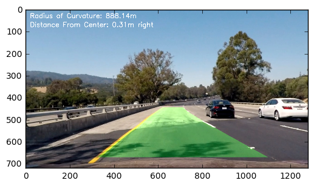

# Advance Lane Detection Project Report
***

_The Markdown Report was generated from [this jupyter notebook]('Pipeline for Advance Lane Detection.ipynb'). To access the code for all the steps listed below, kindly go through the aforementioned notebook._

## Goals and Objectives
---

The goals / steps of this project are the following:

* Compute the camera calibration matrix and distortion coefficients given a set of chessboard images.
* Apply a distortion correction to raw images.
* Use color transforms, gradients, etc., to create a thresholded binary image.
* Apply a perspective transform to rectify binary image ("birds-eye view").
* Detect lane pixels and fit to find the lane boundary.
* Determine the curvature of the lane and vehicle position with respect to center.
* Warp the detected lane boundaries back onto the original image.
* Output visual display of the lane boundaries and numerical estimation of lane curvature and vehicle position.


## Camera Calibration
---

I start by preparing "object points", which will be the (x, y, z) coordinates of the chessboard corners in the world. Here I am assuming the chessboard is fixed on the (x, y) plane at z=0, such that the object points are the same for each calibration image.  Thus, `objp` is just a replicated array of coordinates, and `object_points` will be appended with a copy of it every time I successfully detect all chessboard corners in a test image and `img_points` will be appended with the (x, y) pixel position of each of the corners in the image. The code tries to find a chessboard pattern of 6 rows and 9 columns and if it fails, try to search for a chessboard pattern of 5 rows and 9 columns. I then used the output `obj_points` and `img_points` to compute the camera calibration and distortion coefficients using the `cv2.calibrateCamera()` function.

The code for the same has been implemented in _./utils/cameraCalibration.py_ (check function `get_calibration_matrix()`)

I then use `cv2.undistort` function (check function `undistort()` in _./utils/cameraCalibration.py_) and obtained the following result:


## Pipeline (single images)
---

### 1. Undistoring a Image 

Using `camMat` and `distCoeffs` found in previous step of camera calibration, the raw image from the video is undistorted using `cv2.undistort` function. Following is an eaxmple of undistorted image:


### 2. Image Thresholding
I then use `threshold` function (in _./utils/thresholding.py_) to threshold white and yellow color pixels from HLS channels. The following image shows area threshold by yellow mask and red color shows area thresholded by white mask.


### 2. Perspective Transformation
The perspective transformation was done using following source and destination points.

Source Points:
```
 [  588.   446.]
 [  691.   446.]
 [ 1126.   673.]
 [  153.   673.]
```

Destination Points:
```
 [  200.     0.]
 [ 1080.     0.]
 [ 1080.   720.]
 [  200.   720.]
```

The output after the perspective transform for the thresholded binary is as shown below:


### 3. Lane Detections
I am adding up the pixel values along each column in the image. In my thresholded binary image, pixels are either 0 or 1, so the two most prominent peaks in this histogram will be good indicators of the x-position of the base of the lane lines. I then use that as a starting point for where to search for the lines with margin of `100px` and considering `1/9th` of the image starting from bottom.

Once one of the first frames is processed, I use the last known line location to restrict my search for new lane pixels. The code for the same can be found in _./utils/pipeline.py_.


### 3. Radius of Curvature
If real-world corrdinate (subscript x<sub>real</sub> and y<sub>real</sub>) are related to coordinate in pixel space (x<sub>pix</sub> and y<sub>pix</sub>) by some multiplier, the radius of curvature for real world co-ordinate can be calculated as shown below:


The radius of curvature for the above image comes out to be `888.142m`. 
    

### 4. Plotting back the Identified lanes on Image




# Final Video
---

The final video of the pipeline implementation can be accessed [here](https://youtu.be/pC7CRrP74iQ). To smoothen out the output, the weigths for the polynomial fit are updated as weight of previously detected lines. For implemetation details check `./utils/line.py`.

The video of the final output can be accessed by clicking the following image link:
[](http://www.youtube.com/watch?v=pC7CRrP74iQ)


# Discussion
---
The code does not perform quite well on challenge videos as the creation of binary image does not encapsulate the lanes under varied illumination color shades in challenge videos. The pipeline could be made more robust by normalizing image (using histogram equilization or CLAHE) to account for illumination variations.

Manually tuning parameters for Computer Vision pipeline was extremely tedious. The project made me realize the significance of Machine Learning and Deeplearning based approach used in the previous project for behaviour cloning.
